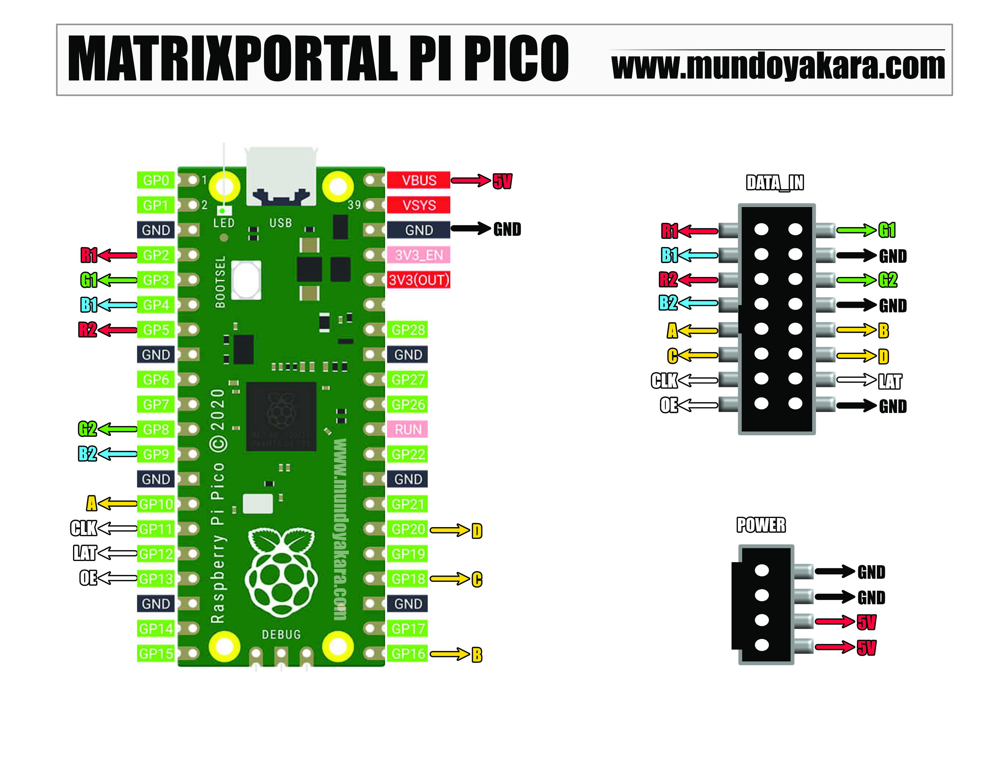

### MatrixPortal Raspberry pi pico 2040 

Este proyecto te permite mostrar imagenes en formato BMP, en una, dos y hasta 4 pantallas RGB LED MATRIX con una RASPBERRY PI PICO 2040
cada una con una resolucion de 32x64 logrando incluso reproducir imagenes divididas cada 32 pixeles creando la ilucion de animacion simple, ideal para multiples proyectos a futuro

se hace uso de circuitpython permitiendo modificar en tiempo real las imagenes y el codigo sin necesidad de reprogramar el raspberry pi pico

En el proyecto original se hace uso del 2040 feather auspiciado por adafruit
en el cual se hace uso del pin gp29 no existente en el pi pico 2040 tradicional

Asi que me di a la tarea de remapear los pines para hacerlo totalmente compatible con la rapsberry pi pico: https://s.click.aliexpress.com/e/_Ddxk4E3

Se puede usar el basido de 4 MB de almacenamiento de las cuales dispondremos unicamente de 611 KB para imagenes o mi recomendacion usar una pi pico de 16 MB para disponer de 12.6 MB para imagenes y animaciones

he remapeado los pines de adafruit por los comunes en Raspberry Pi Pico 2040 gracias a la documentacion en: https://www.waveshare.com/wiki/RGB-Matrix-P3-64x32#cite_note-2

ademas en el video tutorial: https://www.youtube.com/channel/UCewluu5y7lA4QnXBJa_AbwQ
se enseña de manera simple a redimencionar imagenes y hasta a convertir .gif o plantillas de sprites a animaciones compatibles con cuetros proyecto

pagina para redimencionar y crear animaciones: https://www.piskelapp.com/p/create/sprite
pagina para convertir a bmp: https://imagen.online-convert.com/es/convertir-a-

si deseas modificar en tiempo real el codigo para ajustarlo a futuras actualizaciones o cambios en el codigo, la mejor herramienta es el mu editor: https://codewith.mu/en/download

"Proyecto derivado de https://learn.adafruit.com/32x32-square-pixel-display/code

he agregado varias animaciones adicionales en la carpeta "/animaciones"
si quieres puedes crear las tuyas con mi tutorial y hacer un pull request para seguir agregando animaciones para aquellos que se les dificulta la creacion de estas

Recuerda que el conocimiento no es para competir, el conocimiento es para compartir